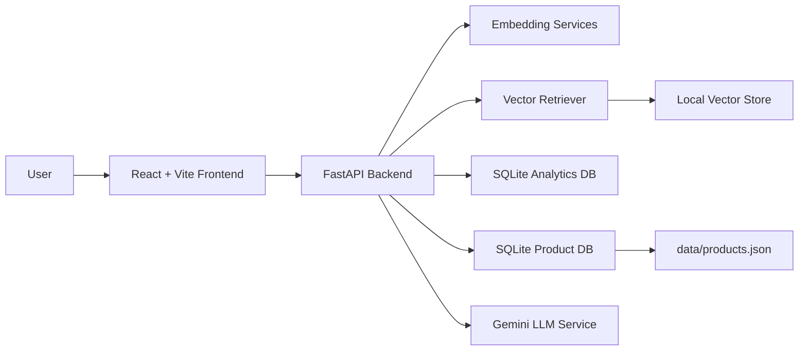

# Multimodal Product Catalogue Intelligence

Multimodal Product Catalogue Intelligence is a full-stack product discovery system for e-commerce catalogues. It lets users search products with natural language, uploaded images, or a fused text-plus-image query, then tracks search behavior so catalogue teams can identify abandoned searches and content gaps.

The project combines a React frontend, FastAPI backend, local vector retrieval, SQLite analytics, and AI services for embeddings, reranking, product descriptions, and visual attribute extraction.

## Table of Contents

- [Features](#features)
- [Architecture](#architecture)
- [Technology Stack](#technology-stack)
- [Project Structure](#project-structure)
- [Data Flow](#data-flow)
- [Prerequisites](#prerequisites)
- [Environment Variables](#environment-variables)
- [Installation](#installation)
- [Data Ingestion](#data-ingestion)
- [Running the Application](#running-the-application)
- [API Reference](#api-reference)
- [Frontend Experience](#frontend-experience)
- [Testing](#testing)
- [Troubleshooting](#troubleshooting)
- [Contributing](#contributing)

## Features

- Text search over product names, descriptions, and metadata.
- Image search using product image embeddings.
- Combined multimodal search with an adjustable fusion weight.
- Cross-encoder reranking for stronger text-search relevance.
- Product detail pages with AI-assisted description generation.
- Visual attribute extraction for product intelligence tags.
- Analytics dashboard for total searches, CTR by modality, zero-result rate, abandonment rate, daily volume, and abandoned queries.
- Smooth frontend motion, dark mode support, responsive layouts, and a moss/copper/ivory color system.

## Architecture



The application is split into three major layers:

- Frontend: React, TypeScript, Vite, Tailwind CSS, Zustand, Recharts, and Lucide icons.
- Backend API: FastAPI, Pydantic, async SQLAlchemy, Uvicorn, and Python service modules.
- AI and storage: CLIP image embeddings, sentence-transformer text embeddings, cross-encoder reranking, Gemini LLM calls, local vector storage, and SQLite analytics.

## Technology Stack

| Area | Tools |
| --- | --- |
| Frontend | React, TypeScript, Vite, Tailwind CSS, Zustand, Recharts |
| Backend | Python, FastAPI, Pydantic, SQLAlchemy async, Uvicorn |
| Embeddings | `openai/clip-vit-base-patch32`, `sentence-transformers/all-MiniLM-L6-v2` |
| Reranking | `cross-encoder/ms-marco-MiniLM-L-6-v2` |
| LLM features | Google Gemini 2.5 Flash through `GEMINI_API_KEY` |
| Data | JSON catalogue, local vector store, SQLite database |
| Tests | Pytest |

## Project Structure

```text
multimodal-catalogue/
  backend/
    main.py                 FastAPI app entry point
    config.yaml             Model and retrieval defaults
    ingest.py               Catalogue ingestion script
    db/database.py          Database models and session setup
    models/schemas.py       Pydantic request/response schemas
    routers/                Search, product, and analytics routes
    services/               Embedding, retrieval, and LLM services
  data/
    products.json           Seed product catalogue
  frontend/
    src/
      api/client.ts         Axios API client
      components/           Shared UI components
      pages/                Search, results, product detail, analytics
      store/useStore.ts     Zustand search-result state
    package.json            Frontend scripts and dependencies
  tests/                    Backend test suite
  README.md                 Project documentation
```

## Data Flow

1. The catalogue is ingested from `data/products.json`.
2. Product records are saved to the local database.
3. Text and image embeddings are generated for retrieval.
4. Search requests are sent from the frontend to `/api/search/*`.
5. The backend embeds the query, retrieves candidates, optionally reranks them, and returns products with scores.
6. Search events are logged as abandoned by default.
7. When a user opens a result, `/api/analytics/click` marks the event as clicked.
8. The analytics dashboard summarizes search health and catalogue gaps.

## Prerequisites

- Python 3.11 or newer.
- Node.js 18 or newer.
- npm.
- Git.
- A Google Gemini API key for LLM-powered descriptions and attribute extraction.

## Environment Variables

Create a `.env` file in the project root:

```env
GEMINI_API_KEY=your_gemini_api_key_here
```

The frontend API client currently points to:

```text
http://localhost:8000/api
```

Update `frontend/src/api/client.ts` if your backend runs on a different host or port.

## Installation

Clone the repository and enter the app folder:

```bash
git clone <repository-url>
cd multimodal-catalogue
```

Create and activate a Python virtual environment:

```bash
python -m venv venv
```

Windows:

```powershell
.\venv\Scripts\activate
```

macOS or Linux:

```bash
source venv/bin/activate
```

Install backend dependencies:

```bash
pip install -r backend/requirements.txt
```

Install frontend dependencies:

```bash
cd frontend
npm install
cd ..
```

## Data Ingestion

Run ingestion before starting the API for the first time:

```bash
python backend/ingest.py --catalogue data/products.json
```

This prepares product records and the local retrieval index. The first run can take longer because embedding models may need to download and initialize.

## Running the Application

Start the backend from the project root:

```bash
uvicorn backend.main:app --reload
```

The API runs at:

```text
http://127.0.0.1:8000
```

FastAPI docs are available at:

```text
http://127.0.0.1:8000/docs
```

Start the frontend in a second terminal:

```bash
cd frontend
npm run dev
```

The Vite app typically runs at:

```text
http://localhost:5173
```

## API Reference

### Health

`GET /`

Returns a simple API status response.

### Search

`POST /api/search/text`

Searches by text query.

```json
{
  "query": "minimal running shoes",
  "top_k": 12
}
```

`POST /api/search/image`

Searches by uploaded image. Send multipart form data with:

- `image`: uploaded image file.
- `top_k`: number of results.

`POST /api/search/combined`

Searches with text and image together. Send multipart form data with:

- `query`: text query.
- `image`: uploaded image file.
- `fusion_weight`: image/text fusion balance.
- `top_k`: number of results.

### Products

`GET /api/products/{id}`

Returns a single product.

`POST /api/products/{id}/describe`

Generates or refreshes an AI product description.

`POST /api/products/{id}/extract-attributes`

Extracts visual attributes such as product style, material, shape, or other detected tags.

### Analytics

`POST /api/analytics/click`

Marks a search event as clicked.

```json
{
  "event_id": "uuid",
  "product_id": "uuid"
}
```

`GET /api/analytics/summary`

Returns dashboard metrics for search volume, click-through rates, abandonment, zero-result searches, and top abandoned queries.

`GET /api/analytics/gaps`

Returns the most common zero-result queries.

## Frontend Experience

The frontend has four main views:

- Search: choose text, image, or combined search; adjust fusion weight for multimodal search.
- Results: browse ranked product matches with match scores.
- Product detail: inspect product metadata, price, description, and AI-generated intelligence tags.
- Analytics: monitor search behavior and catalogue quality.

The visual design uses a moss, copper, ivory, stone, and charcoal palette. It intentionally avoids purple, pink, and blue tones. Motion is handled with smooth page entrances, staggered result cards, hover transitions, focus states, and a reduced-motion fallback for accessibility.

## Testing

Run backend tests from the project root:

```bash
pytest -v tests/
```

Run frontend checks from the frontend folder:

```bash
cd frontend
npm run build
npm run lint
```

## Troubleshooting

- If model loading is slow, wait for the first backend startup or ingestion run to finish; transformer models can take time to initialize.
- If search returns no data, rerun ingestion and confirm `data/products.json` exists.
- If the frontend cannot reach the API, confirm FastAPI is running on `http://localhost:8000` and check `frontend/src/api/client.ts`.
- If LLM features fail, confirm `GEMINI_API_KEY` is present in `.env`.
- If image upload search fails, verify the backend dependencies installed correctly, especially Pillow and the model libraries.

## Contributing

- Keep backend endpoints typed with Pydantic schemas where practical.
- Add or update tests when retrieval, analytics, or API behavior changes.
- Keep UI changes consistent with the existing React, Tailwind, and Zustand patterns.
- Avoid committing generated local databases, vector stores, virtual environments, or build artifacts.
